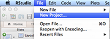
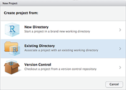
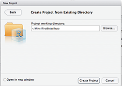
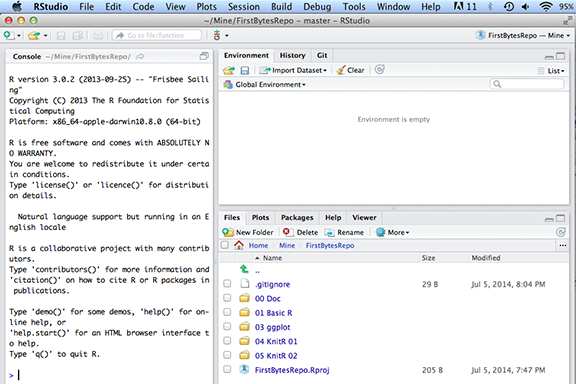
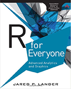
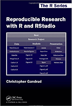

First Bytes 2014 - R Technology Workshop
===
###This is how my RStudio is configured:
```{r}
sessionInfo()
```

You also need to install LaTeX if you want to generate PDF files from KnitR.  

 http://latex-project.org/ftp.html

###Getting Started - Clone Repository:

**Phils-MacBook-Pro:Mine pcannata$ pwd**  
/Users/pcannata/Mine  
**Phils-MacBook-Pro:Mine pcannata$ git clone https://github.com/pcannata/FirstBytesRepo.git**  
Cloning into 'FirstBytesRepo'...  
remote: Counting objects: 19, done.  
remote: Compressing objects: 100% (12/12), done.  
remote: Total 19 (delta 3), reused 19 (delta 3)  
Unpacking objects: 100% (19/19), done.  
Checking connectivity... done  
**Phils-MacBook-Pro:Mine pcannata$ ls -a FirstBytesRepo/**  
.  		.Rprofile.R		00 Doc			03 ggplot		05 KnitR 02  
..			.git			01 Basic R		04 KnitR 01		FirstBytesRepo.Rproj  

###Getting Started - Creating a New RStudio Project:

  

  

  

  

###Recommended Books:

   
http://www.amazon.com/Everyone-Advanced-Analytics-Graphics-Addison-Wesley/dp/0321888030/ref=sr_1_1?ie=UTF8&qid=1404611818&sr=8-1&keywords=R+for+everyone

http://www.amazon.com/Reproducible-Research-RStudio-Chapman-Series/dp/1466572841/ref=sr_1_1?ie=UTF8&qid=1404612129&sr=8-1&keywords=reproducible+research+with+r

###Basic R Language Constructs

See also http://cran.r-project.org/doc/manuals/r-devel/R-lang.html, http://www.r-tutor.com/r-introduction, and http://www.cookbook-r.com/

```{r}
source("../01 Basic R/Basic.R", echo = TRUE)
```

###R Dataframes

See also http://www.r-tutor.com/r-introduction/data-frame

```{r}
source("../02 R Dataframes/Dataframes.R", echo = TRUE)
```

###ggplot2

See also http://ggplot2.org/

```{r}
source("../03 ggplot/01 Histograms.R", echo = TRUE)
```

###slidify

See also http://slidify.org and http://slidify.org/start.html


