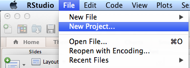
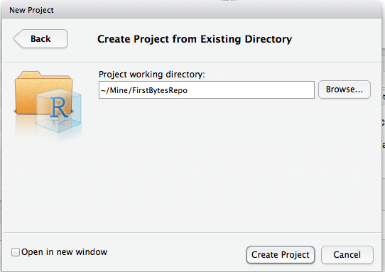
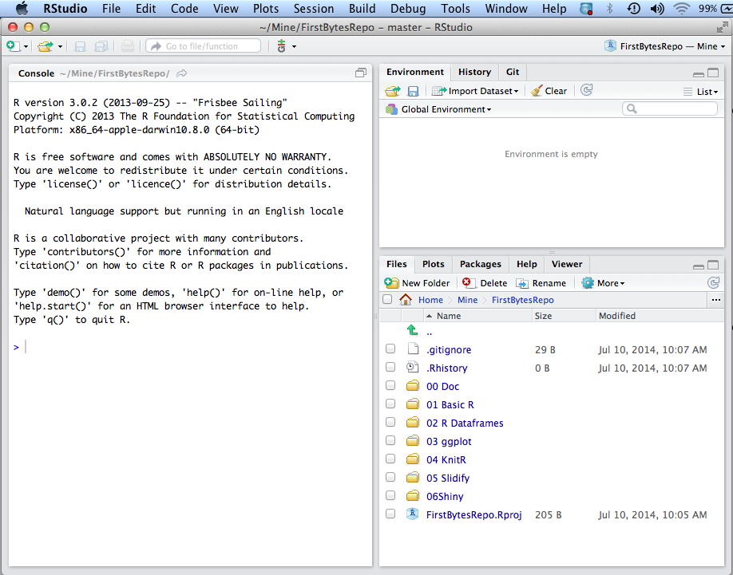
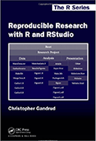

First Bytes 2014 - R Technology Workshop
===
**R is the most popular free software environment for statistical computing and graphics. ggplot2 is a data visualization package for R that that can be used to produce publication-quality graphics. This workshop is designed to intrduce you to R and ggplot as well as RStudio, KnitR, Slidify, and Shiny.  
See also http://opensource.com/business/14/7/interview-david-smith-revolution-analytics**

###This is how my RStudio is configured:
```{r}
sessionInfo()
```

You also need to install LaTeX if you want to generate PDF files from KnitR.  

 http://latex-project.org/ftp.html

###Getting Started - Clone the First Bytes GiT Repository:

**Phils-MacBook-Pro:Mine pcannata$ pwd**  
/Users/pcannata/Mine  
**Phils-MacBook-Pro:Mine pcannata$ git clone https://github.com/pcannata/FirstBytesRepo.git**  
Cloning into 'FirstBytesRepo'...  
remote: Counting objects: 19, done.  
remote: Compressing objects: 100% (12/12), done.  
remote: Total 19 (delta 3), reused 19 (delta 3)  
Unpacking objects: 100% (19/19), done.  
Checking connectivity... done  
**Phils-MacBook-Pro:Mine pcannata$ ls -a FirstBytesRepo/**  
.  		.Rprofile.R		00 Doc			03 ggplot		05 KnitR 02  
..			.git			01 Basic R		04 KnitR 01		FirstBytesRepo.Rproj  

###Getting Started - Create a New RStudio Project for the code in the cloned repository:

  

  

  

  

###Recommended Books:

   
http://www.amazon.com/Everyone-Advanced-Analytics-Graphics-Addison-Wesley/dp/0321888030/ref=sr_1_1?ie=UTF8&qid=1404611818&sr=8-1&keywords=R+for+everyone

http://www.amazon.com/Reproducible-Research-RStudio-Chapman-Series/dp/1466572841/ref=sr_1_1?ie=UTF8&qid=1404612129&sr=8-1&keywords=reproducible+research+with+r

###Basic R Language Constructs

See also http://cran.r-project.org/doc/manuals/r-devel/R-lang.html, http://www.r-tutor.com/r-introduction, and http://www.cookbook-r.com/

```{r}
source("../01 Basic R/Basic.R", echo = TRUE)
```

###R Dataframes

See also http://www.r-tutor.com/r-introduction/data-frame

```{r}
source("../02 R Dataframes/Dataframes.R", echo = TRUE)
```

###ggplot2

See also http://ggplot2.org/, http://cran.r-project.org/web/packages/ggplot2/ggplot2.pdf, and https://groups.google.com/forum/#!forum/ggplot2

```{r}
source("../03 ggplot/01 Histograms.R", echo = TRUE)
```

```{r}
source("../03 ggplot/plotFunction.R", echo = TRUE)
```

You should be able to open FirstBytesRepo/00 Doc/4diamonds.png now.

###KnitR

See also http://yihui.name/knitr/ and http://kbroman.github.io/knitr_knutshell/

###slidify

See also http://slidify.org and http://slidify.org/start.html

###shiny

See also http://shiny.rstudio.com, http://shiny.rstudio.com/tutorial, and https://www.shinyapps.io/

From the main FirstBytesRepo directory:  
setwd("06 Shiny")  
library(shiny)  
runApp()  

package ‘shinyapps’ is not available (for R version 3.0.2)  
library("devtools", lib.loc="/Library/Frameworks/R.framework/Versions/3.0/Resources/library")  
install_github( repo = "shinyapps", username="rstudio" )  
shinyapps::setAccountInfo(name='pcannata', token='3ECF447A741004F6A8B7208C9ED778E1', secret='ebpHrZqN3AQzqfEnxB+gy0Au/ThAdsfQL7aFPJNE')  

http://shiny.rstudio.com/articles/shinyapps.html  
library(shinyapps)  
deployApp()  


